# The continuous time Fourier Transform
## Fourier Transform
Fourier Transform for Aperiodic signals
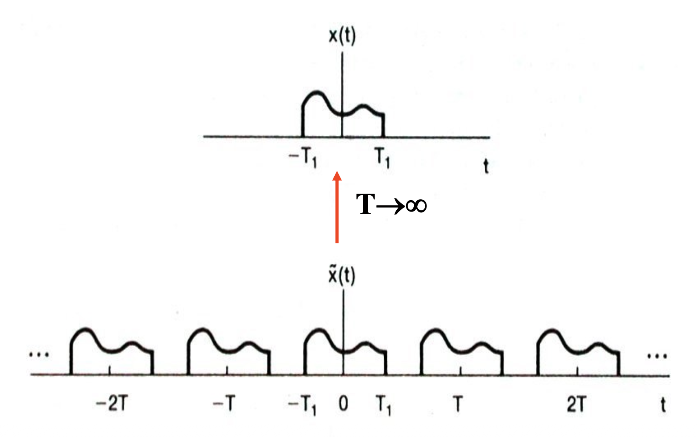
Because for periodic signal, $\widetilde{x}(t)\xleftrightarrow{FS}a_k$$$\widetilde{x}(t)=\sum_{k=-\infty}^{+\infty}a_ke^{jk\omega_0t}, a_k=\frac{1}{T}\int_{T}\widetilde{x}(t)e^{-jk\omega_0t}dt$$
For aperiodic signal x(t), $x(t)\xleftrightarrow{F}X(j\omega)$ $$X(j\omega)=\int_{-\infty}^{+\infty}x(t)e^{-j\omega t}=F^{-1}\{X(j\omega)\},\ x(t)=\frac{1}{2\pi}\int_{-\infty}^{+\infty}X(j\omega)e^{j\omega t}d\omega=F\{x(t)\}$$
> In polar form, $X(j\omega)=|X(j\omega)|e^{j\phi (\omega)}=|X(j\omega)|e^{j\angle X(j\omega)}$,
> In rectangular form, $X_{j\omega}=R_e[X_{j\omega}]+jI_m[X(j\omega)]$

Relation  between Fourier series and Fourier transform
x(t) is one period of $\widetilde{x}(t)$ over $s≤t≤s+T$ $$a_k=\frac{1}{T}\int_{T}\widetilde{x}(t)e^{-jk\omega_0t}dt=\frac{1}{T}\int_{s}^{s+T}x(t)e^{-jk\omega_0t}dt=\frac{1}{T}\int_{-\infty}^{+\infty}x(t)e^{-jk\omega_0t}dt$$
## Inverse Fourier Transform
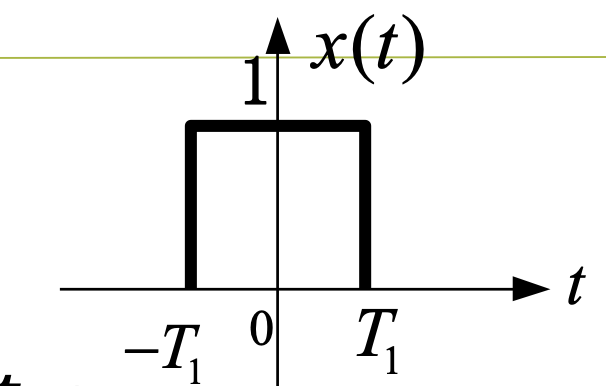
$$\widetilde{x}(t)=\frac{1}{2\pi}\int_{-\infty}^{+\infty}2\frac{\sin(\omega T_1)}{\omega}e^{j\omega t}d\omega$$
> As $T \rightarrow \infty$, this signal converges to x(t) everywhere, except at the discontinuities.
> $𝑡 = ±𝑇_1$, $\widetilde{x}(t)$ converges to 1/2, which is the average of the values of x(t) on both sides of the continuity.

## Converge of Fourier transform
Dirichlet conditions:
- x(t) is absolutely integrable. $\int_{-\infty}^{+\infty}|x(t)|dt < \infty$
- x(t) have a finite number of maxima and minima within any finite interval.
- x(t) have a finite number of discontinuity within any finite interval. Furthermore, each of the discontinuities must be finite.
$\rightarrow$ signal has Fourier transform. Otherwise, the signal has no Fourier Transform.
> However, Some periodic signals ($sin(\omega_0t), e^{j\omega_0t}$), neither absolutely integrable, nor square integrable, however, it still has Fourier Transform.

## Properties of the Continuous time Fourier Transform
### Linearity
If $x(t)\xleftrightarrow{F}X(j\omega)$ and $y(t)\xleftrightarrow{F}Y(j\omega)$, then $ax(t)+by(t)\xleftrightarrow{F} aX(j\omega)+bY(j\omega)$
### Time Shifting
If $x(t)\xleftrightarrow{F}X(j\omega)$, then $x(t-t_0)\xleftrightarrow{F}e^{-j\omega t_0}X(j\omega)$
### Conjugation and Conjugate Symmetry
- If $x(t)\xleftrightarrow{F} X(j\omega)$, then $x^*(t)\xleftrightarrow{F}X^*(-j\omega)$
- If $x(t)=x^*(t)$(real), then $X(j\omega)=X^*(-j\omega)$
- If $x(t)=x_e(t)+x_o(t)=x^*(t)$, then $X(j\omega)=X_R(j\omega)+jX_I(j\omega)=X_e(j\omega)+X_o(j\omega)$, and $x_e(t)\xleftrightarrow{F} X_R(j\omega)=X_e(j\omega)$, $x_o(t)\xleftrightarrow{F}jX_I(j\omega)=X_o(j\omega)$
### Differentiation and Integration
- If $x(t)\xleftrightarrow{F}X(j\omega)$, then $x'(t)\xleftrightarrow{F}j\omega X(j\omega)$
- if $x(t)\xleftrightarrow{F}X(j\omega)$, $\int_{-\infty}^{t}x(\tau)d\tau\xleftrightarrow{F}\frac{1}{j\omega}X(j\omega)+\pi X(0)\delta(\omega)$
### Time and Frequency Scaling
If $x(t)\xleftrightarrow{F}X(j\omega)$, then $x(at)\xleftrightarrow{F}\frac{1}{|a|}X(\frac{j\omega}{a})$. 
### Duality
If $x(t)\xleftrightarrow{F}X(j\omega)$, then $X(jt)\xleftrightarrow{F}2\pi x(-\omega)$.
### Parseval's Relation
If $x(t)\xleftrightarrow{F}X(j\omega)$, then $\int_{-\infty}^{+\infty}|x(t)|^2dt=\frac{1}{2\pi}\int_{-\infty}^{+\infty}|X(j\omega)|^2d\omega$.
### The Convolution Property
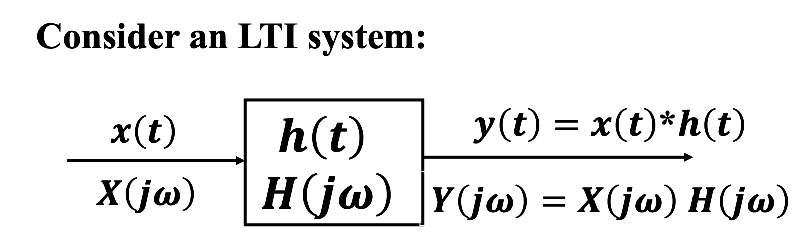
### The Multiplication Property
$r(t)=s(t)p(t)\xleftrightarrow{F}R(j\omega)=\frac{1}{2\pi}S(j\omega)*P(j\omega)$

## Frequency-Selective Filtering with Variable Center Frequency
### A Bandpass Filter:
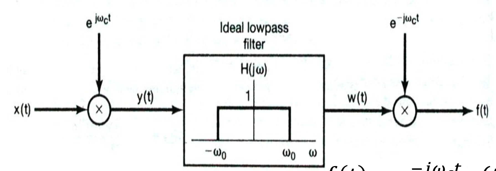
- Implementation:
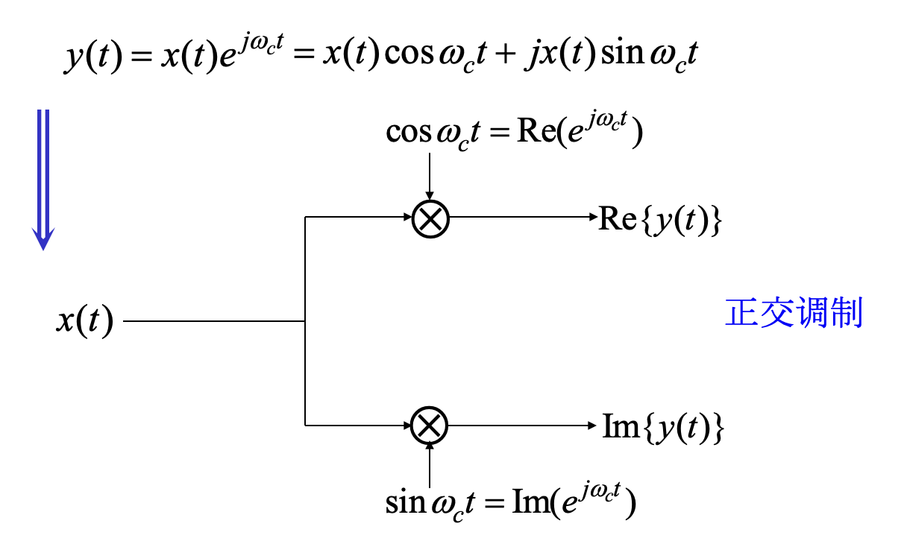
### Modulation & Demodulation
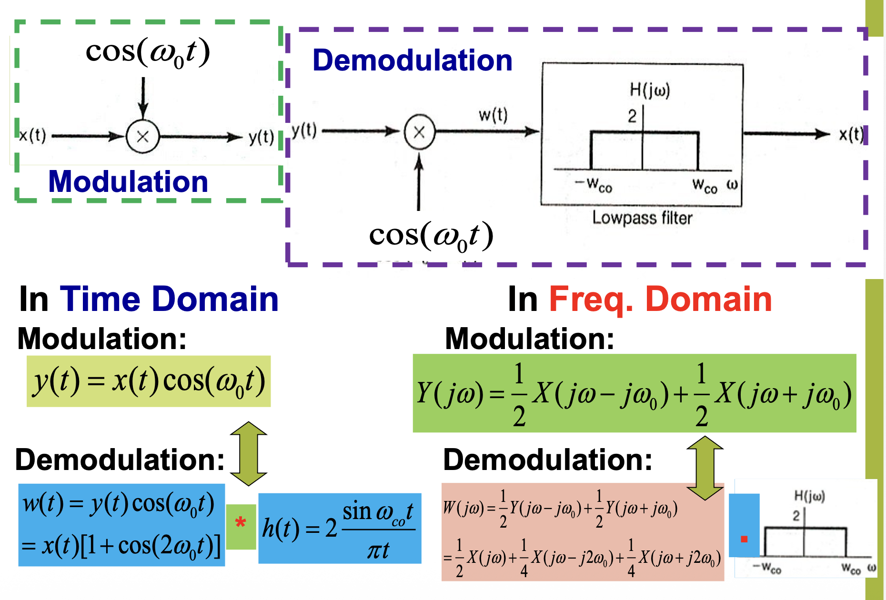
### Synchronization in Amplitude Demodulation:
1. $e^{j\omega_ct}$:
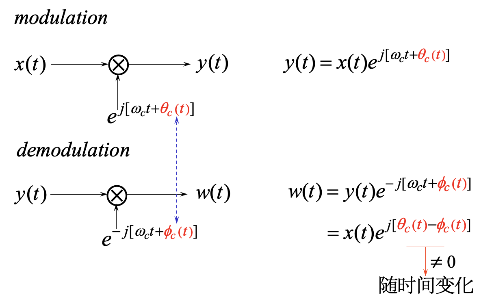
2. $cos(\omega_ct)$:
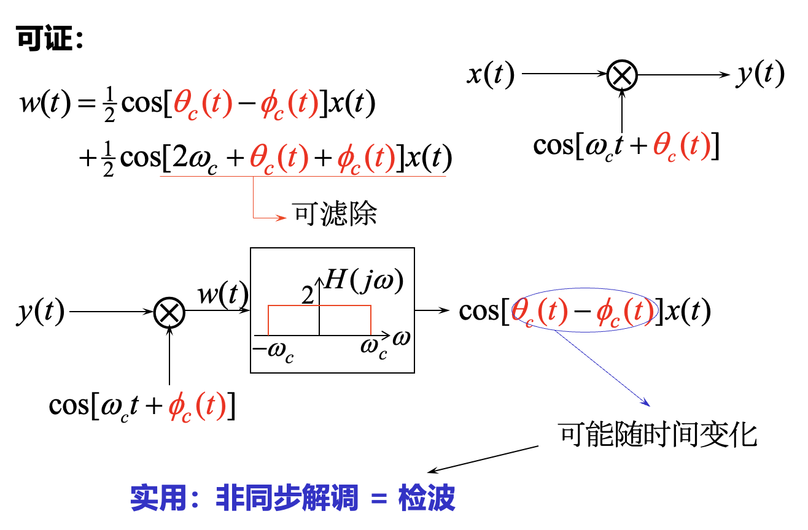

## System Characterized by Linear Constant-Coefficient Differential Equation
LCCDE: $$\sum_{k=0}^{N}a_k\frac{d^ky(t)}{dt^k}=\sum_{k=0}^{M}b_k\frac{dx^k(t)}{dt^k}$$
Fourier transform: $$\sum_{k=0}^{N}a_k(j\omega)^kY(j\omega)=\sum_{k=0}^Mb_k(j\omega)^kX(j\omega)$$
Define: $$H(j\omega)=\frac{Y(j\omega)}{X(j\omega)}=\frac{\sum_{k=0}^Mb_k(j\omega)^k}{\sum_{k=0}^{N}a_k(j\omega)^k}(frequency\ response)$$
# Time and Frequency Characterization of Signal and System
## The magnitude-phase representation of the Fourier Transform
### Decomposition
$$x(t)=\frac{1}{\pi}\int_{-\infty}^{+\infty}X(j\omega)e^{j\omega t}=\lim_{\Delta\omega\to0}\sum_{\omega_i}\frac{\Delta\omega_i}{2\pi}|X(j\omega_i)|e^{j[\omega_it+\angle X(j\omega_i)]}$$
> Magnitude: $\frac{\Delta\omega_i}{2\pi}|X(j\omega_i)|$. relative strength of the frequency components
> Phase: $\angle X(j\omega_i)$. relative position of the frequency components

### Effect of Magnitude
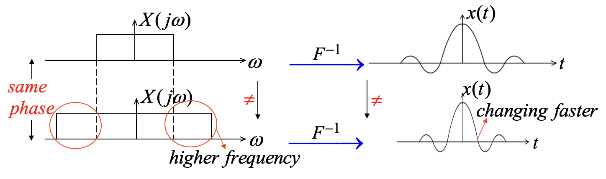
### Effect of Phase
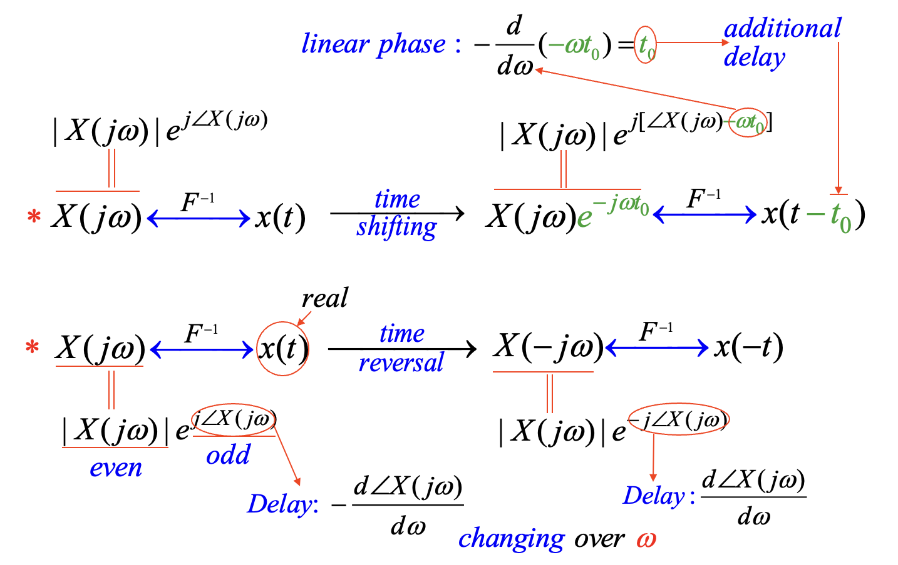
## The magnitude-phase representation of the Frequency Response of LTI system
### The function of Magnitude and Phase of $H(j\omega)$
#### Concept of filtering
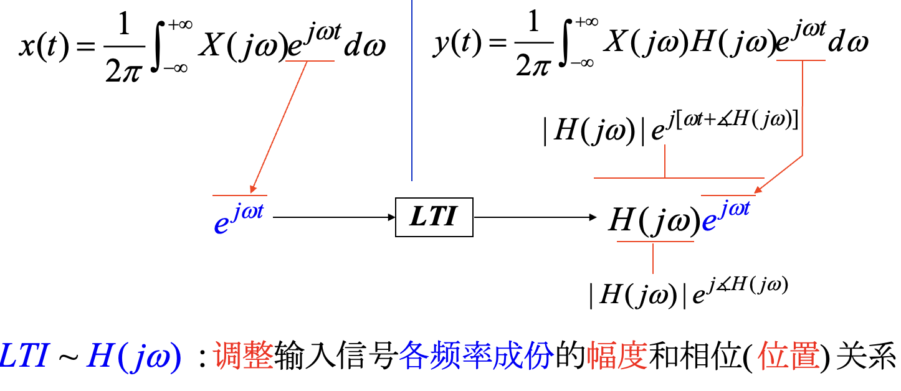
#### The function of LTI System
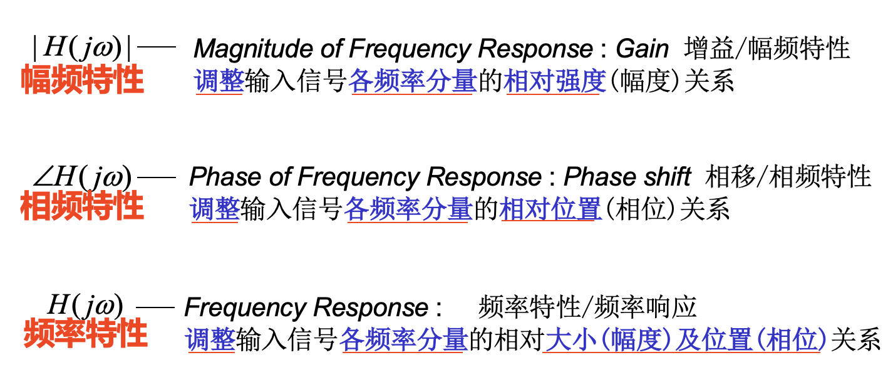
### Linear and Nonlinear Phase
- Linear Phase: $H(j\omega)=|H(j\omega)|e^{j\angle H(j\omega)}$, Linear phase: $\angle H(j\omega)=-\omega t_0$
- Effect of Linear Phase: Same Delay; Do not change the relative position of the frequency components.
- Nonlinear Phase: $\angle H(j\omega)≠-\omega t_0$
- Effect of Nonlinear Phase: Changing the relative position of the frequency components.
### Group Delay
- Definition: $\tau (\omega)=-\frac{d}{d\omega}\{\angle H(j\omega)\}$
> 频率为$\omega$的成分对应的延时
- Interpretation: $\tau (\omega)\ \to$ time shifting on $e^{j\omega t}$
## Time-Domain Properties of Ideal Frequency-Selective Filters
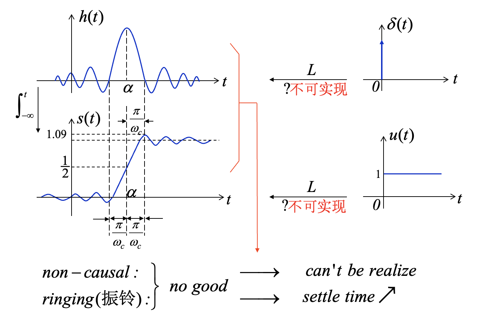
## Time-Domain and Frequency-Domain Aspects of Nonideal Filters
### Description of Realistic Filters in Frequency-Domain
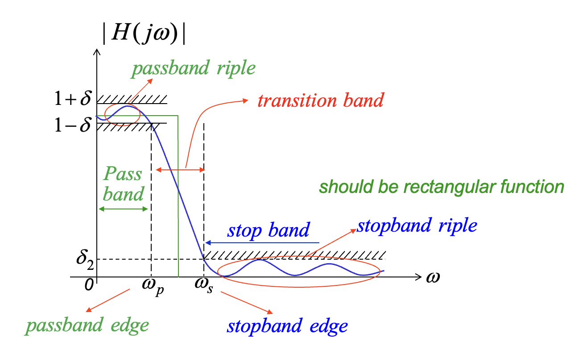

### Description of Realistic Filters in Time-Domain
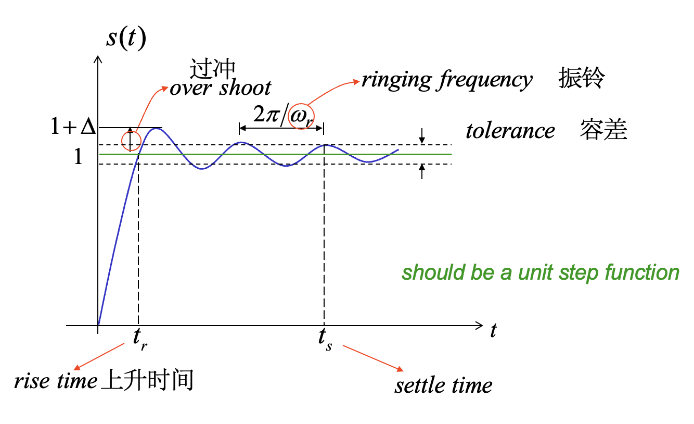
### Trade-off between Frequency and Time Domain
$$trainsition\ band\ \leftrightarrow settling\ time$$
# Sampling
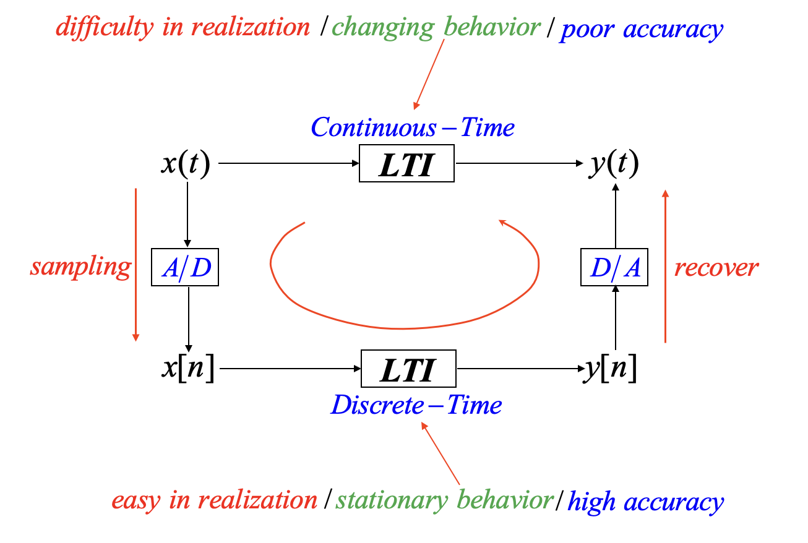
## The Sampling Theorem
$$bandlimit\ \to Sampling\ Theorem\to (x(t)\leftrightarrow x[n]) Sampling\ conditions$$
### Sampling
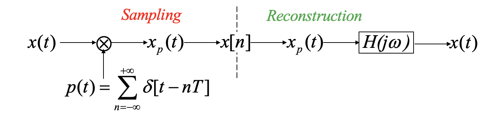
### Sampling Theorem
- Let $x(t)$ is bandlimit Signal with $X(j\omega)=0$ for $|\omega|>\omega_m$,
- then $x(t)$ is uniquely determined by $x(nT)$ or $x[n]$ for $n=0, ±1, ±2, ……,$ if $\omega_s > 2\omega_m$ 
$$\omega_s = \frac{2\pi}{T}, T: sampling\ interval$$
## The Effect of Under-Sampling: Aliasing
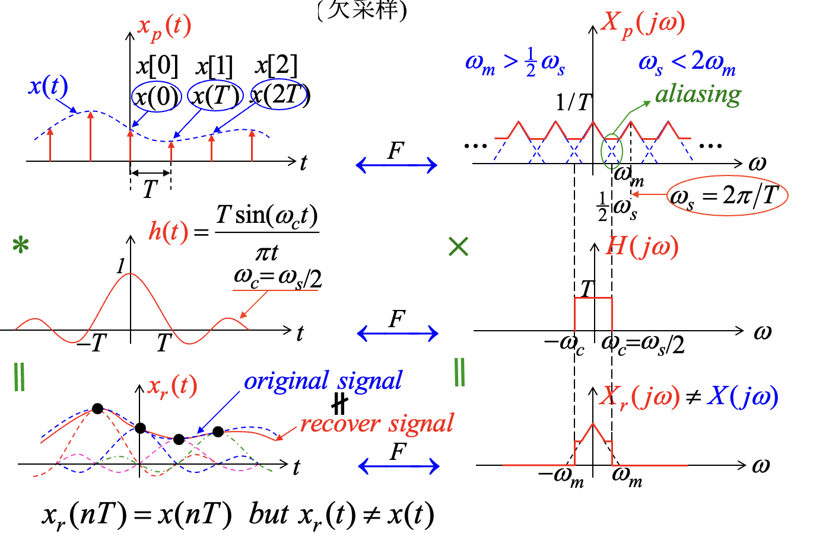

# Laplace Transform
For $s=\sigma + j\omega$ general complex variable, 
$$H(s)=\int_{-\infty}^{+\infty}h(t)e^{-st}dt$$
Compared to Fourier Transform which is only suitable for energy and stable signals and systems, Laplace Transform have wide application.
## Definition
$$x(t)\xleftrightarrow{L} X(s)$$
$$X(s)=\int_{-\infty}^{+\infty}x(t)e^{-st}dt\to L\{x(t)\}$$
## Region of Convergence (ROC)
$$X(s)=\int_{-\infty}^{+\infty}x(t)e^{-st}dt=\int_{-\infty}^{+\infty}x(t)e^{-\sigma t}e^{-j\omega t}dt$$
**ROC**: Range of **Re{s}** (or $\sigma$) for X(s) to converge

> Generally, X(s) is a ratio of polynomials in complex variables
> $$X(s)=\frac{N(s)}{D(s)}$$
> N(s): numerator; D(s): denominator
> poles: the roots of D(s); zeros: the roots of N(s)

## The Region of Convergence for Laplace Transform
- Property 1: The ROC of X(s) consists of strips parallel to $j\omega$-axis in the s-plane.
- Property 2: For rational Laplace transform, the ROC does not contain any poles.
- Property 3: If x(t) is of finite duration & absolutely integrable, then the ROC is the entire s-plane.
- Property 4: If x(t) is right-sided, and if the line Re{s}=$\sigma_0$ is in the ROC, then all values of s for which $Re\{s\}> \sigma_0$ will also in the ROC.
- Property 5: If x(t) is left-sided, and if the line Re{s}=$\sigma_0$ is in the ROC, then all values of s for which $Re\{s\}<\sigma_0$ will also in the ROC.
- Property 6: If x(t) is two-sided, and if the line Re{s}=$\sigma_0$ is in the ROC, then the ROC will consist of a strip in the s-plane that includes the line Re{s}=$\sigma_0$.
- Property 7: If the Laplace transform X(s) of x(t) is rational, then its ROC is bounded by poles or extends to infinity. In addition, no poles of X(s) are constrained in the ROC.
- Property 8: If the Laplace transform X(s) of x(t) is rational, then if x(t) is right sided, the ROC is the region in the s-plane to the right of the rightmost pole. If x(t) is left sided, the ROC is the region in the s-plane to the left of the leftmost pole. 

## The Inverse Laplace Transform
$$x(t)e^{-\sigma t}=F^{-1}[X(\sigma+j\omega)]=\frac{1}{2\pi}\int_{-\infty}^{+\infty}X(\sigma+j\omega)e^{j\omega t}d\omega$$
So, $$x(t)=\frac{1}{2\pi j}\int_{\sigma-j\infty}^{\sigma+\infty}X(s)e^{st}ds$$
## The properties of Laplace Transform
### Linearity
If $x(t)\xleftrightarrow{L}X(s),\ ROC:R_1$ and $y(t)\xleftrightarrow{L}Y(s), ROC:R_2$, then $ax(t)+by(t)\xleftrightarrow{F} aX(j\omega)+bY(j\omega),ROC:R_1∩R_2$
### Time Shifting
If $x(t)\xleftrightarrow{L}X(s), ROC:R$, then $x(t-t_0)\xleftrightarrow{L}e^{-s t_0}X(s), ROC:R$
### Shifting in s-Domain
If $x(t)\xleftrightarrow{L}X(s), ROC:R$, then $e^{s_0t}x(t)\xleftrightarrow{L}X(s-s_0), ROC:R+Re\{s_0\}$
### Time Scaling
If $x(t)\xleftrightarrow{L}X(s), ROC:R$, then $x(at)\xleftrightarrow{L}\frac{1}{|a|}X(\frac{s}{a}), ROC:|a|R$
### Conjugation
If $x(t)\xleftrightarrow{L}X(s), ROC:R$, then $x^*(t)\xleftrightarrow{L}X^*(s^*), ROC:R$
### Convolution
If $x(t)\xleftrightarrow{L}X(s),\ ROC:R_1$ and $y(t)\xleftrightarrow{L}Y(s), ROC:R_2$, then $x(t)*y(t)\xleftrightarrow{L} X(s)Y(s),ROC:R_1∩R_2$
### Differentiation in the time Domain
If $x(t)\xleftrightarrow{L}X(s),\ ROC:R$, then $\frac{d}{dt}x(t)\xleftrightarrow{L}sX(s)\ ROC: Containing\ R$
### Differentiation in s-Domain
If $x(t)\xleftrightarrow{L}X(s),\ ROC:R$, then $-tx(t)\xleftrightarrow{L}\frac{d}{ds}X(s)\ ROC: R$
### The integration in the time Domain
If $x(t)\xleftrightarrow{L}X(s),\ ROC:R$, then $\int_{-\infty}^{t}x(\tau)d\tau\xleftrightarrow{L}\frac{1}{s}X(s)\ ROC: R∩Re\{s\}>0$
### The Initial- and Final-Value Theorems
If $x(t)=0,for\ t<0$. Its LT X(s), ROC: Re{s}>$\sigma_1$
- Then the initial- Value Theorem, $x(0^+)=\lim_{s\to\infty}sX(s)$
- The Final-Value Theorem, $\lim_{t\to \infty}x(t)=x(\infty)=\lim_{s\to 0}sX(s)$

## Analysis and Characterization of LTI systems Using LT
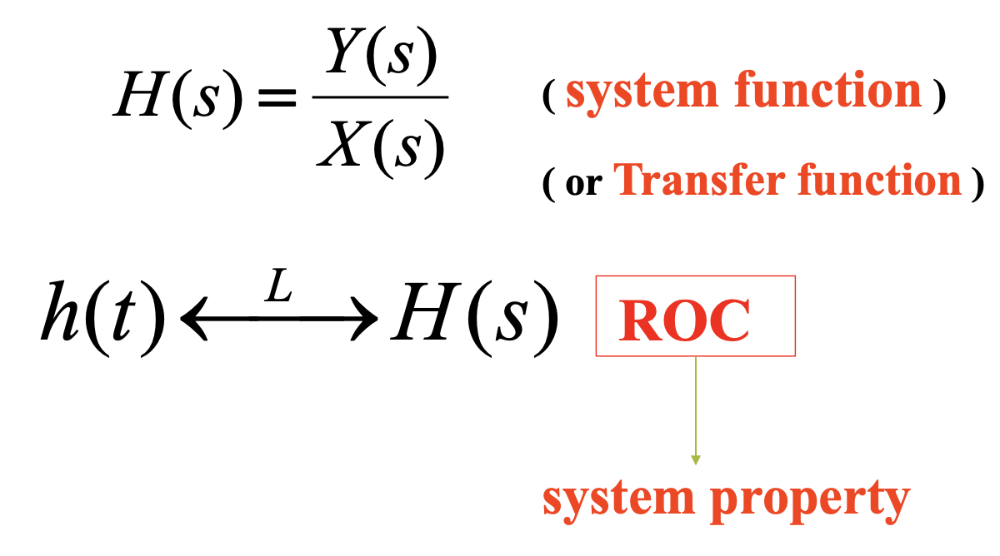
### Causality
- A causal system $\to$ H(s), ROC: right-half plane (h(t)=0, for t<0)
- For rational $H(s)=\frac{N(s)}{D(s)}$
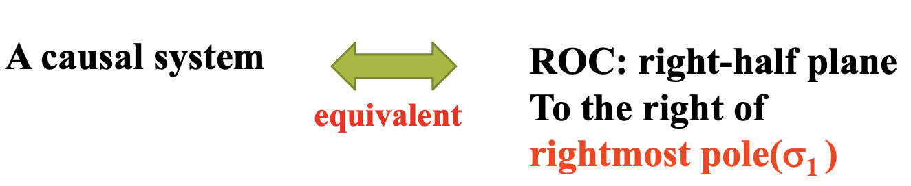
### Stability
- A stable system $\leftrightarrow$ H(s), ROC: includes $j\omega$-axis
> Existence of the Fourier transform is equivalent to system stability
- A causal and stable system with rational
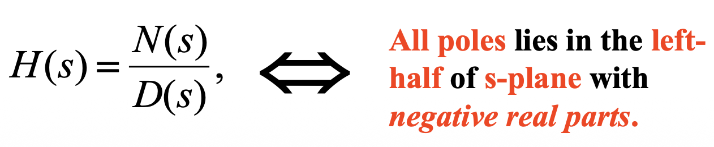
### LTI Systems Characterized by Linear Constant-Coefficient Differential Equations
$$\sum_{k=0}^{N}a_k\frac{d^ky(t)}{dt^k}=\sum_{k=0}^{M}b_k\frac{dx^k(t)}{dt^k}$$
Laplace transform: $$\sum_{k=0}^{N}a_ks^kY(s)=\sum_{k=0}^Mb_ks^kX(s)$$
$$H(s)=\frac{Y(s)}{X(s)}=\frac{\sum_{k=0}^Mb_ks^k}{\sum_{k=0}^{N}a_ks^k}(rational)$$
Usually, a practical system is causal and stable.
## System Representations
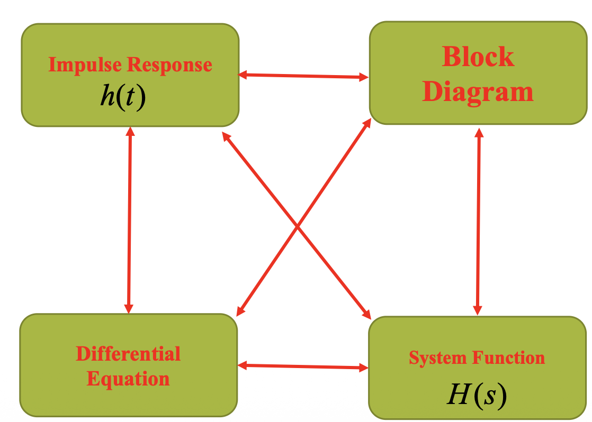
## System Function Algebra and Block Diagram Representation
### Series(cascade)
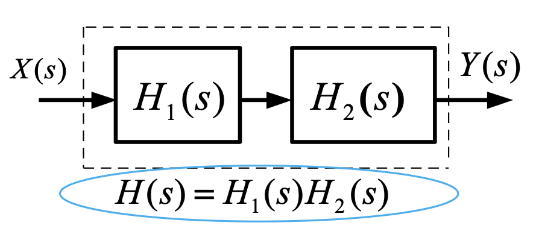
### Parallel
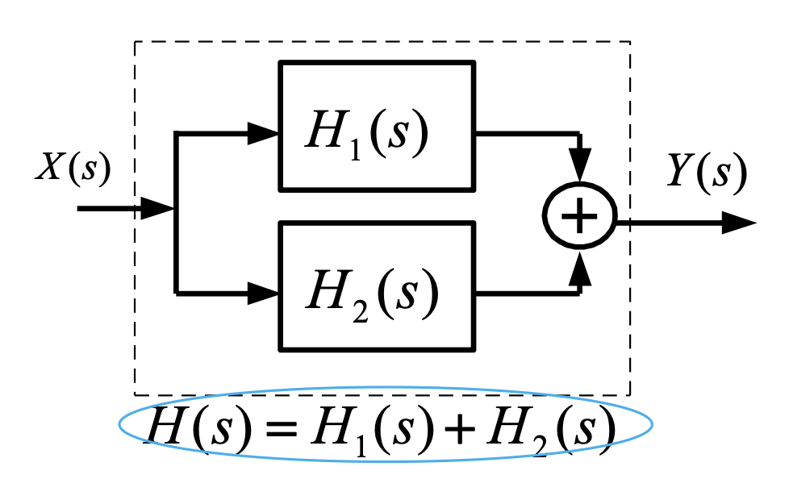
### Feed-back
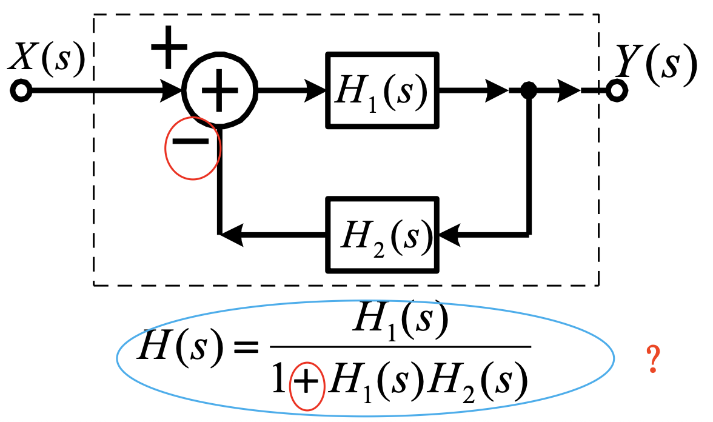
## Basic elements:
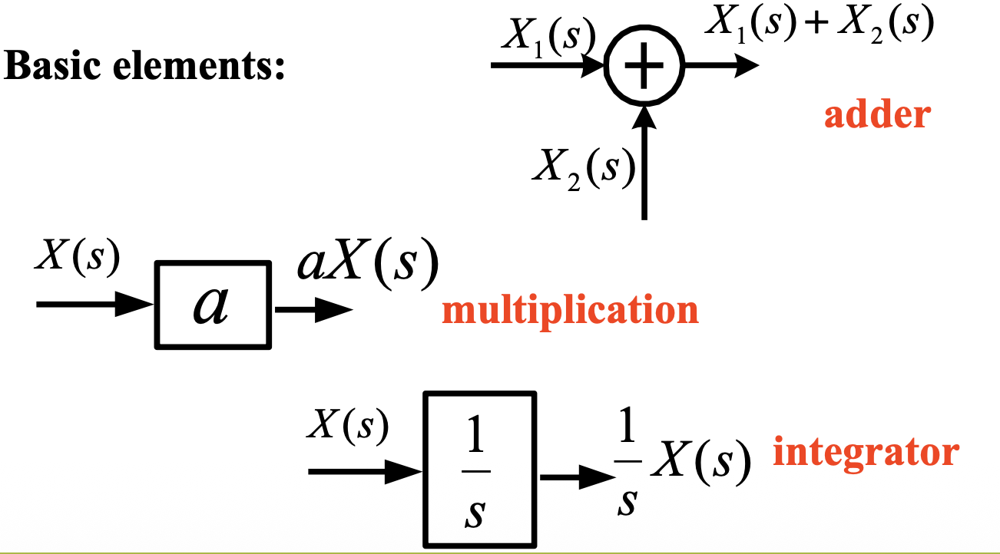
# Z-Transform
## The difference between continuous & discrete eigenfunction
For continuous signal and system:
$$e^{st}\to H(s)\to H(s)e^{st}$$
$$e^{j\omega t}\to H(j\omega)\to H(j\omega)e^{j\omega t}$$
For discrete signal and system:
$$e^{j\omega n}\to H(e^{j\omega})\to H(e^{j\omega})e^{j\omega n}$$
## Z-transform Pair
$$x[n]=\frac{1}{2\pi j}\int_{|z|=r}X(z)z^{n-1}dz$$
$$X(z)=\sum_{n=-\infty}^{+\infty}x[n]z^{-n}$$
## The ROC for z transform
Generally, $\sum_{-\infty}^{+\infty}<+\infty \to r_a< r(|z|) < r_b$
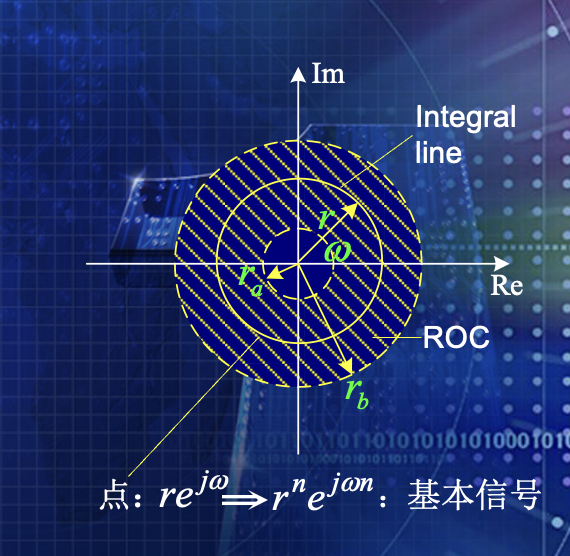
### Properties:
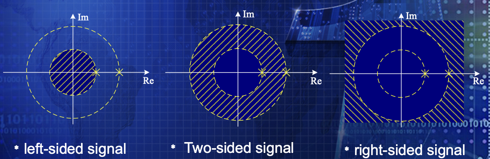
## Properties of Z-transform
### Linearity
### Time shifting
### Scaling
If $x[n]\xleftrightarrow{Z}X(z),\ ROC:R$, then $z_0^nx[n]\xleftrightarrow{Z}X(\frac{z}{z_0}),\ ROC:|z_0|R$
### Time Reversal
If $x[n]\xleftrightarrow{Z}X(z),\ ROC:R$, then $x[-n]\xleftrightarrow{Z}X(\frac{1}{z}),\ ROC:\frac{1}{R}$
### Time Expansion
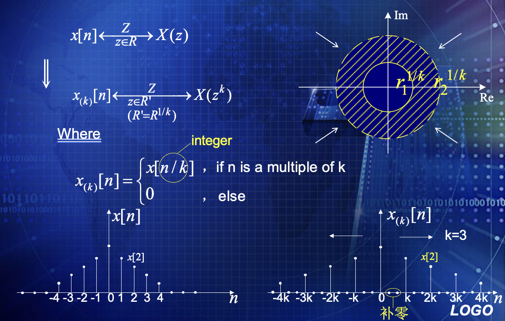
### Conjugation
### Convolution
### Differentiation in Z-domain

## System Function of LTI system
### Causality
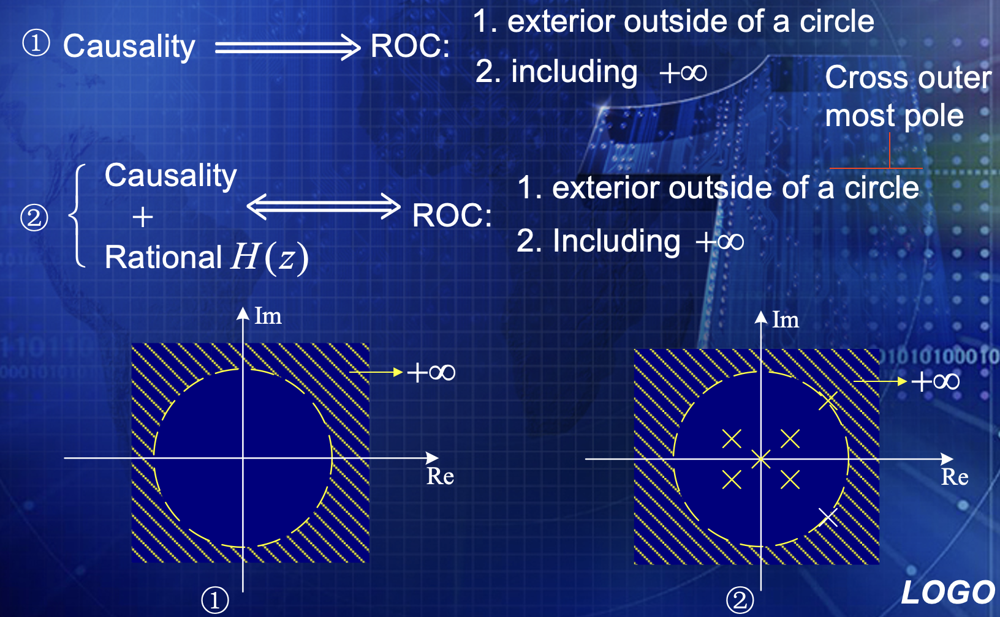
### Stability
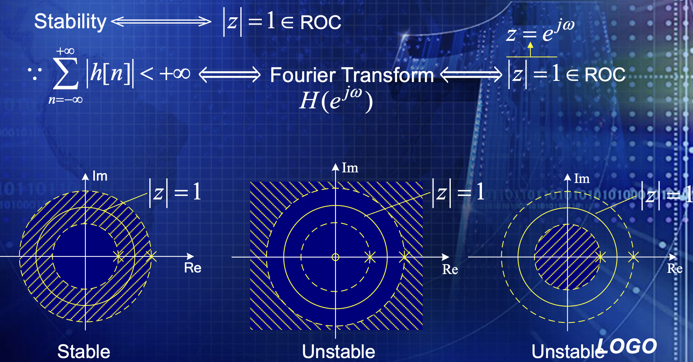
### Summary
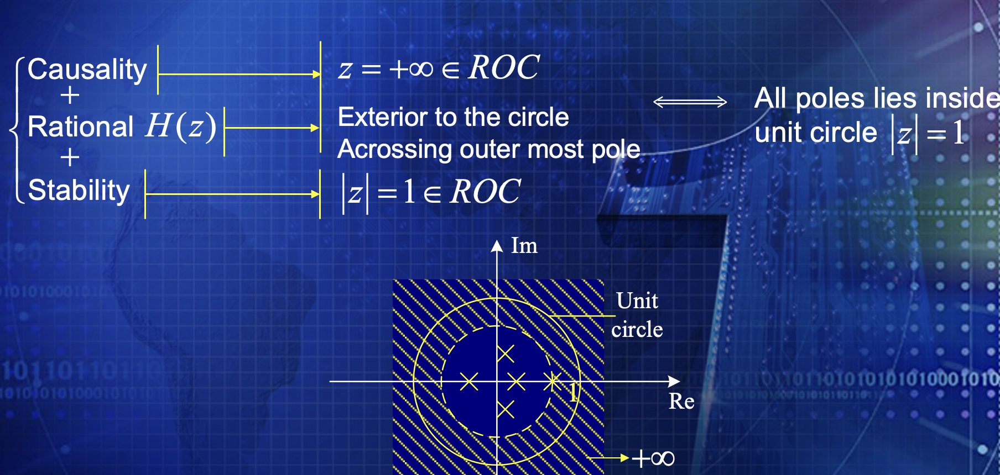